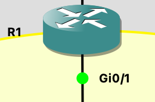
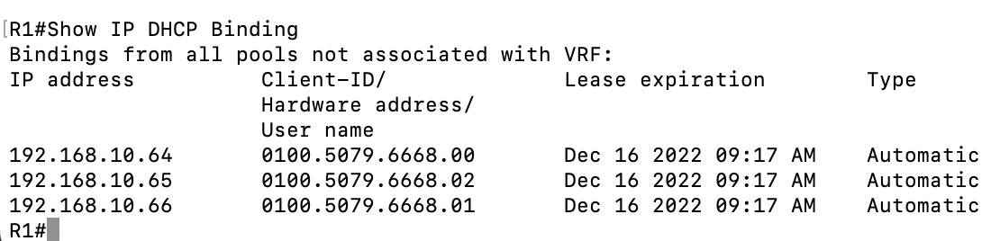
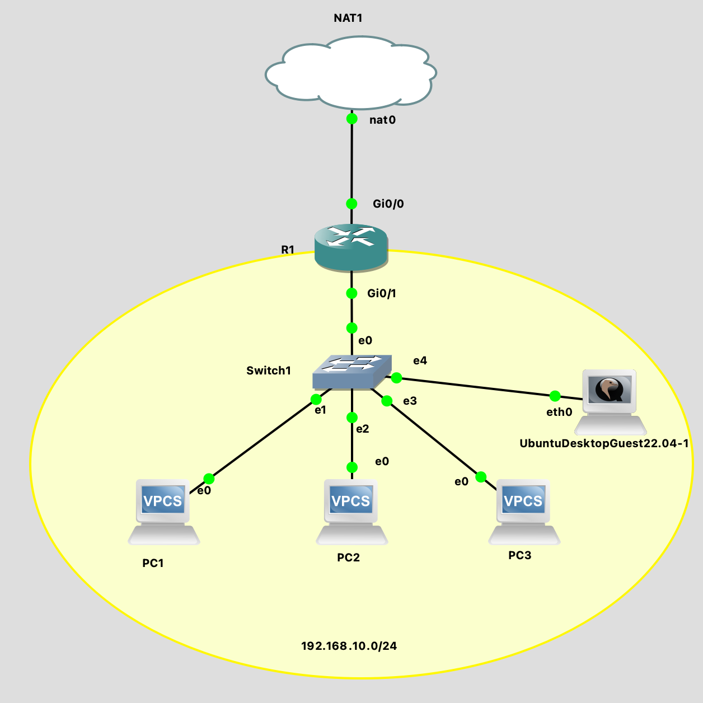
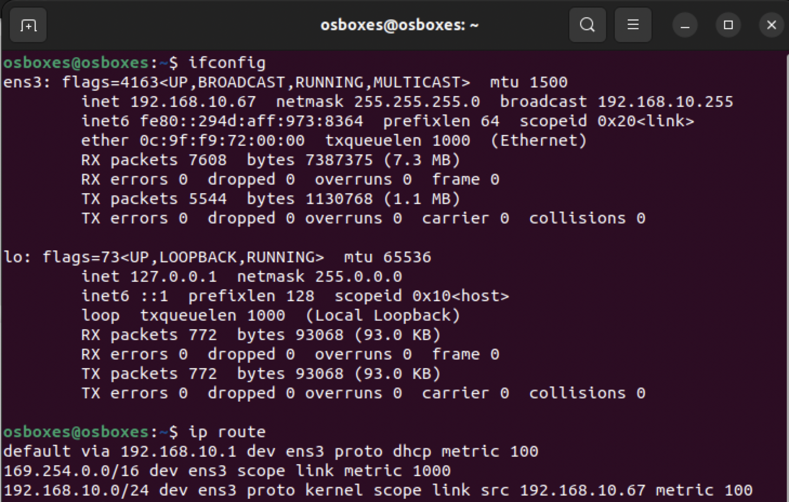

# Laborübung 1: DHCP Server-Konfiguration aus einem Cisco Router auslesen

Vollständige Aufgabenstellung findet man [hier](https://gitlab.com/alptbz/m123/-/blob/main/05_DHCP/01_DHCP%20Server%20Konfiguration%20Cisco.md)

## Erledigte Vorbereitungen
 - Thema eingelesen (Dokumente auf Teams)
 - GNS3 Projekt importiert

## 2. Router starten, einloggen und konfigurierte IP-Adressen auslesen

 - Welche IP-Adresse ist auf dem *Interface* *GigabitEthernet0/0* und *GigabitEthernet0/1* konfiguriert?
   - 192.168.122.90/24
 - Ist das *Interface* *GigabitEthernet0/2* aktiv? Welchen Status hat es?
   - administratively down,  down
 - Wo ist das *Interface* *GigabitEthernet0/1* in der Netzwerkgrafik zu finden?


## 3. Konfiguration anzeigen
 - Mit welchem Befehl (wie lautet die Zeile) wurde der Name des Routers konfiguriert?
  ```
  hostname R1
  ```
   
 - Wie lautet das Passwort für den *remote access* mit TELNET?
  ```
  cisco
  ```

## 4. DHCP Konfiguration
```
network: 192.168.10.0 255.255.255.0
ip address pool: subnet10
default gateway: 192.168.10.1 
dns nameserver: 8.8.8.8, 8.8.4.4
interface: GigabitEthernet0/1
```
- Welche IP-Adresse wird dem ersten DHCP-Client vergeben, der einen DHCP request macht?
```
 192.168.10.64 
```
Denn  192.168.10.1 - 192.168.10.63 sind excluded in der config.

## 5. DHCP Lease
 Link zur Pcap-Datei: 

- Welche IP Adresse wir dem Client zugeteilt?
  - 192.168.10.65
- Nach welcher Zeit müssen die Clients den DHCP lease erneuern?
  - 86400s -> 1 day
- Welche Option Nummer hat die Option "Router"?
  - Option (3)
- Welche Option Nummer hat die Option "Domain Name Server"
    - Option (6)
## 6. VPCS

```
show ip
```
Zeigt Details zur Netzwerkkonfiguration vom Host an wie z.B die IP, die Subnetzmaske sowie die MAC-Adresse. Der DNS Server sowie Informationen vom DHCP-Lease werden angezeigt.

```
dhcp
```
IP-Adresse sowie Subnetzmaske vom Host sowie die IP-Adresse des DHCP-Servers werden angezeigt.
Sowie 'DORA' -> Discover, Offer, Request, Acknowledge
```
ping 192.168.10.1
```
Ein spezifischer Host im lokalen Netzwerk wird angepingt. Diese IP gehoert dem Router. Man kann kontrollieren ob man auf dem lokalen Netzwerk kommunizieren kann.
```
ping google.ch
```
Eine externe Website wird gepingt. Der Host/Router pingt den DNS-Server oder schaut auf der Hostfile nach, welche IP 'google.ch' hat. Kann moeglicherweise nicht klappen, falls der DNS-Server falsch eingestellt wurde bzw. die Hostfile falsch ausgefuellt wurde.

```
ping 8.8.8.8
```
Ein DNS-Server wird angepingt. Das sollte eigentlich immer klappen, solange der DNS-Server online ist (praktisch immer) und der Host eine funktionierende Internetverbindung hat.
## 7. PCs konfigurieren
```
set pcname PCX
dhcp
```
## 8. Cisco CLI Befehl herausfinden - DHCP bindings
``` 
SHow IP DHCP Binding
```


## 9. Ubuntu Desktop Guest


```
sudo apt install net-tools
ifconfig
ip route
```
## Weiterführende Ressourcen 
- Dokumente auf Teams ueber DHCP
- [Default Route on Linux](https://www.systranbox.com/the-default-route-in-linux/)
## Neue Lerninhalte
Das war für mich neu: 
 - Cisco CLI Befehle
 - Linux CLI Befehle
 - DHCP genauer angeschaut
 - Pakete ueber Wireshark analysiert

## Reflexion
Mithilfe dieses Labors habe ich mein Vorwissen ueber DHCP vertieft und hab auch live zugeschaut, wie solche DHCP-Pakete aussehen. Ich habe auch die Basics der  Cisco CLI Befehle kennengelernt. Die Linux CLI ist sehr aehnlich zur MacOS CLI (beides Unix). Pakete ueber DHCP zu analysieren war sehr interessant.

