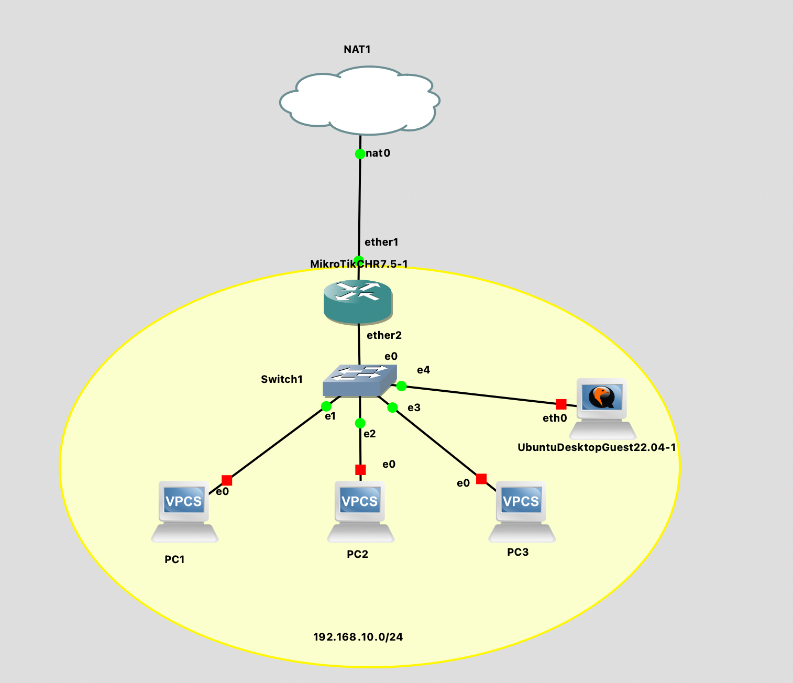
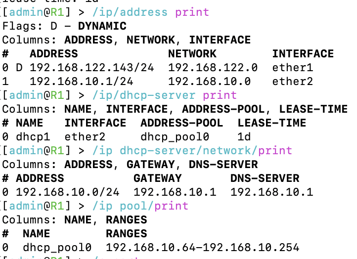
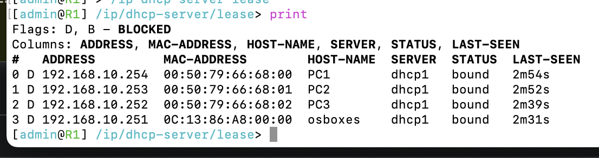

# Laborübung 2: DHCP Server auf MikroTik Router

Vollständige Aufgabenstellung findet man [hier](https://gitlab.com/alptbz/m123/-/blob/main/05_DHCP/02_DHCP%20Server%20auf%20MikroTik%20Router.md)

## Erledigte Vorbereitungen
 - Thema eingelesen (Dokumente auf Teams)
- GNS3 Projekt importiert, Cisco Router  ausgetauscht fuer Mikrotik CHR Router
- Passwort 'admin' gesetzt 


## Grundkonfiguration Microtik Router R1
- Anzahl Netzwerkadapter auf 4 gesetzt
```
/system identity set name=R1
/ip address add address=192.168.10.1/24 interface=ether2 network=192.168.10.0
/ip dns set allow-remote-requests=yes
/ip firewall nat add action=masquerade chain=srcnat out-interface=ether1
```

## R1 DHCP-Setup
```/ip/dhcp-server/ setup

Select interface to run DHCP server on 

dhcp server interface: ether2
Select network for DHCP addresses 

dhcp address space: 192.168.10.0/24
Select gateway for given network 

gateway for dhcp network: 192.168.10.1
If this is remote network, enter address of DHCP relay 

dhcp relay: 8.8.8.8
Select pool of ip addresses given out by DHCP server 

addresses to give out: 192.168.10.64-192.168.10.254
Select DNS servers 

dns servers: 192.168.10.1
Select lease time 

lease time: 1d
```
## R1 DHCP-Config
DHCP Config:
<br/>

<br/>
Vorhandene DHCP Leases:
<br/>



## Komplette config
```
# jan/19/2023 07:28:47 by RouterOS 7.5
# software id = 
#
/disk
set sata1 disabled=no
/interface wireless security-profiles
set [ find default=yes ] supplicant-identity=MikroTik
/ip pool
add name=dhcp_pool0 ranges=192.168.10.64-192.168.10.254
/port
set 0 name=serial0
/ip address
add address=192.168.10.1/24 interface=*2 network=192.168.10.0
/ip dhcp-client
add interface=*1
/ip dhcp-server
add address-pool=dhcp_pool0 interface=*2 lease-time=1d name=dhcp1
/ip dhcp-server network
add address=192.168.10.0/24 dns-server=192.168.10.1 gateway=192.168.10.1
/ip dns
set allow-remote-requests=yes
/ip firewall nat
# no interface
add action=masquerade chain=srcnat out-interface=*1
/system identity
set name=R1
```

## Weiterführende Ressourcen 
- Dokumente auf Teams ueber DHCP
- [Mikrotik Wiki](https://wiki.mikrotik.com/wiki/Manual:IP/DHCP_Server#Quick_Setup_Guide)
## Neue Lerninhalte
- Mikrotik CLI

## Reflexion
- Ging sehr flott, war sehr aehnlich zum Labor mit Cisco
- DHCP-Setup war einfacher als bei Cisco 
