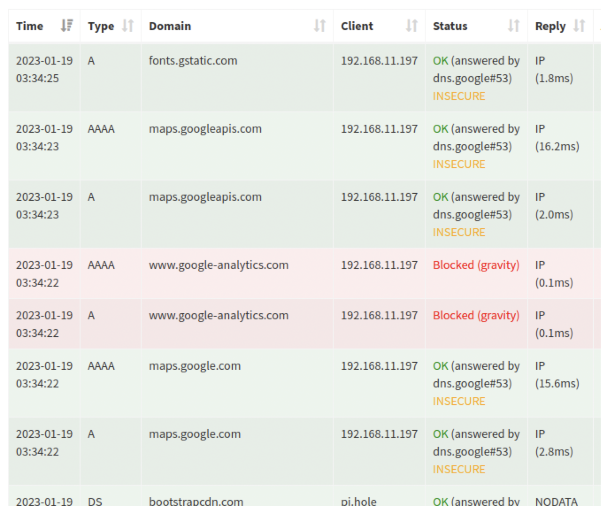

# Laborübung 3: DNS Server - PiHole

Vollständige Aufgabenstellung findet man [hier](https://gitlab.com/alptbz/m123/-/blob/main/06_DNS/01_DNS%20Server.md)

## Erledigte Vorbereitungen
- Thema eingelesen (Dokumente auf Teams)
- GNS3 Projekt importiert
- Passwort 'admin' gesetzt 
- Konfiguration importiert
- Lizenz aktiviert
- PC1 gestartet

## 1. Ping Anfrage
In PC1
```
ping tbz.ch
```
Services die laufen, weil dies klappt:
- DHCP -> Damit wir uns mit dem Router im Netzwerk verbinden koennen und Anfragen schicken und erhalten koennen.
- DNS-Server -> Damit wir von  tbz.ch die IPv4 Adresse kriegen und mithilfe dieser uns verbinden koennen. 

## 2. DNS Query sniffen

### Fragen

- Welcher Host ist der DNS Server?
  - 192.168.11.1, der Router
- Wie lange ist die Antwort (DNS Query Response) gültig?
  - TTL ist 175 Sekunden
- Was macht der Router mit der erhaltenen DNS Query?
  - Leitet es an den PC1 weiter
- Ist die DNS Anfrage signiert? Könnte diese Anfrage gefälscht werden? 
  - Die DNS-Anfrage hat keine Signatur wie in der DNSSEC Anfrage, die bestaetigt, dass es von einer vertrauenswuerdigen Quelle kommt. Also koennte es theoretisch gefaelscht sein.

## 3. PiHole aufsetzen

- Debian VM hinzugefuegt,mit SW1 verbunden, VM gestartet siehe Screenshot:


### Statische IP Adresse konfigurieren
- Folgende Commands ausgefuehrt
  ```
  sudo apt autoremove cloud-init
  cd /etc/network/interfaces.d/
  sudo mv 50-cloud-init default
  sudo nano default
  ```
  default-file sieht folgendermassen aus jetzt:
  ```
  auto lo
  iface lo inet loopback

  auto ens4
  iface ens4 inet static
        address 192.168.11.10
        netmask 255.255.255.0
        gateway 192.168.11.1
        dns-nameservers 192.168.11.1
  ```
### Pi-hole installieren
```
curl -sSL https://install.pi-hole.net | bash
```
```
    http://192.168.11.10/admin
    admin-pw: O0rC-2-M 
```
****
### Korrekter DNS Server im DHCP Server eintragen
R1 Konsole:
```
/ip/dhcp-server/network/set 0 dns-server=192.168.11.10
```
##### Verifizierung
Capture mit Wireshark zwischen SW1 und R1 zeigt, dass die Source Address 192.168.11.10 (Pi-Hole IP) und die Destination 8.8.8.8 (DNS-Server von Google, unterstuetzt DNSSEC):

### Fragen
- Wie teilt der Client dem Server mit, dass er DNSSEC verwenden möchte?
  - Das Bild von vorher hat unter der Spalte "Queries" den folgenden Text:
  ```
  Z: 0x8000
    1... .... .... .... = DO bit: Accepts DNSSEC security RRs
    .000 0000 0000 0000 = Reserved: 0x0000
  ```
- Wie unterscheidet sich eine Query Response mit DNSSEC gegenüber einer ohne?
  - Die Rubrik mit Informationen zu dem Key der Signatur, welcher Algorithmus benutzt wurde fuer den Key, wann die Signatur kreiert wurde und wann sie ungueltig ist sowie die Information, von wem die Signatur stammt.
  - 

## 4. Pi-hole Ad und Telemetry blockierende Funktionen ausprobieren
Anfrage auf tbz.ch gibt folgenden Log aus:

Warum benutzt die TBZ Google Analytics?
 Eine Anfrage auf rargb.to, einer oeffentlichen Torrenting Website, schien genauso "harmlos":
 

## Weiterführende Ressourcen 
 - Pi-Hole Website
 - DNS Dokumente Teams

## Neue Lerninhalte
- DNSSEC kannte ich bis jetzt nicht, obwohl ich relativ viel mit DNS gearbeitet habe weil ich meine eigene Domain hab und alles.

## Reflexion
- DNSSEC war sehr interessant, jedoch hat dieses Labor sehr viel Zeit konsumiert, da ich lange den falschen Befehl auf dem Router fuer den DNS-Server benutzt habe.

