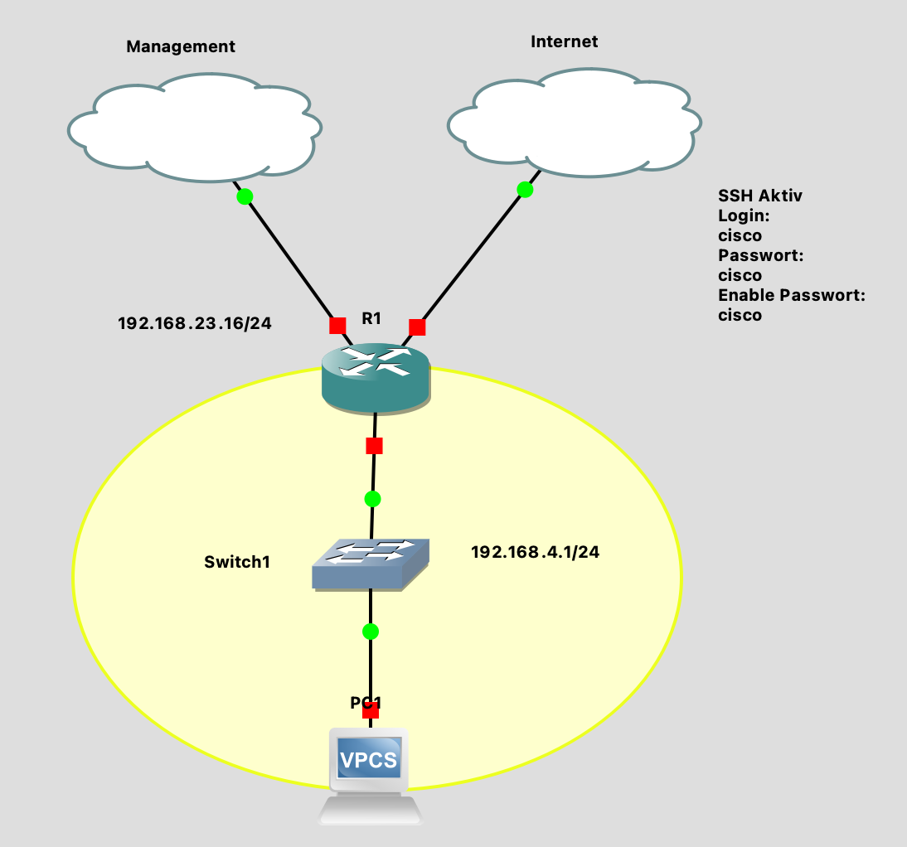
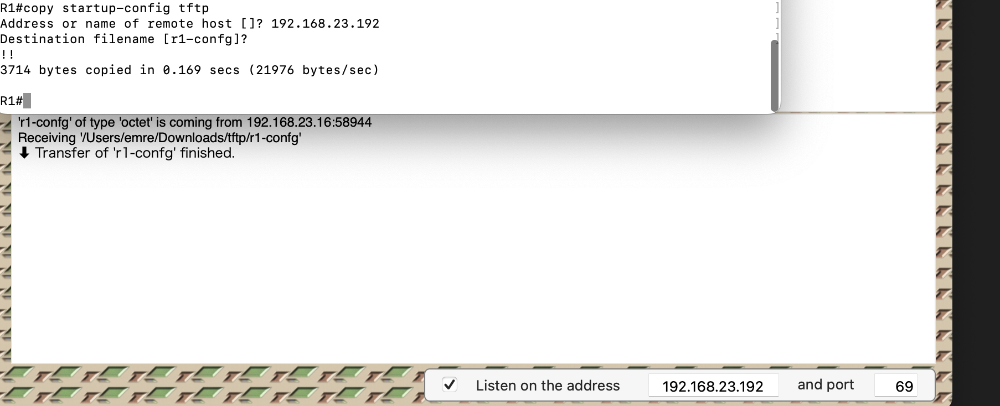

# Laborübung 4: TFTP

Vollständige Aufgabenstellung findet man [hier](https://gitlab.com/alptbz/m123/-/blob/main/07_Datei%C3%BCbertragung/01_TFTP.md)

## Erledigte Vorbereitungen
 - Projekt von Teams importiert (Version fuer Person 2)
  
  
## 1. TFTP Server auf lokalem PC starten
 - Tool von Carl ("Trivial") hat nicht geklappt, habe dann selber das Tool "PumpKin" heruntergeladen von [hier](https://kin.klever.net/pumpkin/binaries/) (sieht sehr alt aus aber funktioniert)
 - Root Ordner angelegt
## 2. Konfiguration via TFTP auf den lokalen PC senden/kopieren
  ```
  copy startup-config tftp
  ```
  
  Im "PumpKin" Programm musste ich die IP eingeben statt ein interface auszuwaehlen, wie es in den Alternativen "TFTP Server" und "Trivial" zu finden ist.
#### Fragen
- Wann Werden Änderungen an der startup-config übernommen?
  - Beim Neustart, da dann die startup-config neu geladen wird ins NVRAM und eigentlich das Betriebssystem konfiguriert.

## 3. Konfiguration bearbeiten
  - Position in Klassenliste = 15
  - Neue IP = 192.168.39.0/24 
  - Alle Subnetze der Art 192.168.4 angepasst durch "Search and Replace"
  - Neue Config File ist im Ordner "config" zu finden.

## 4. Konfiguration auf den Router uploaden
- Mit welcher Abfolge von Befehlen kann eindeutig festgestellt werden, dass die Subnetzanpassung erfolgreich war und alle Services (DHCP, DNS, usw.) eindeutig funktionieren?
   - s
## 5. TFTP Protokoll beobachten

## Weiterführende Ressourcen 

## Neue Lerninhalte


## Reflexion
