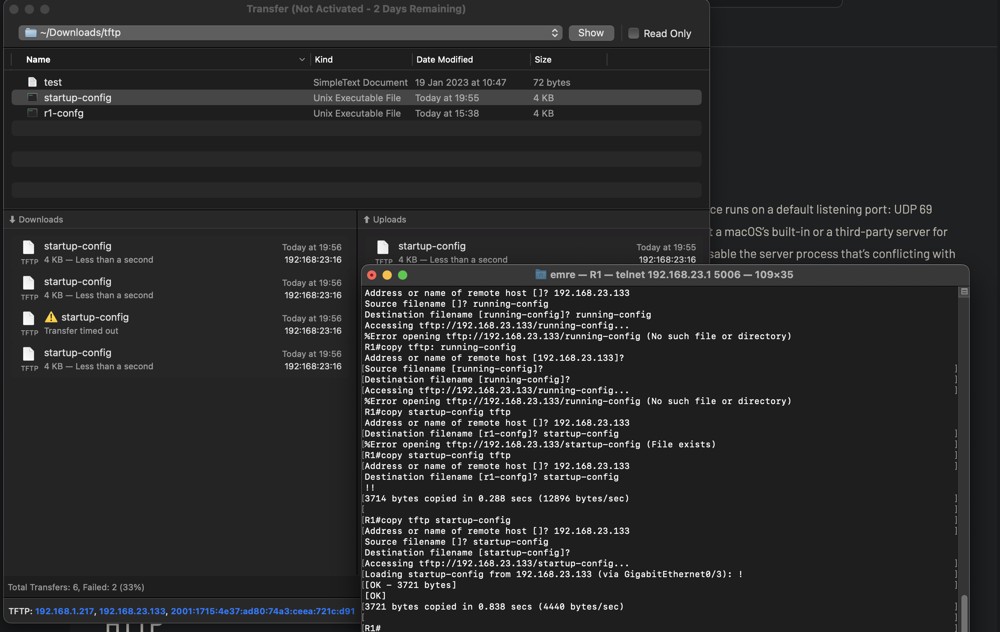
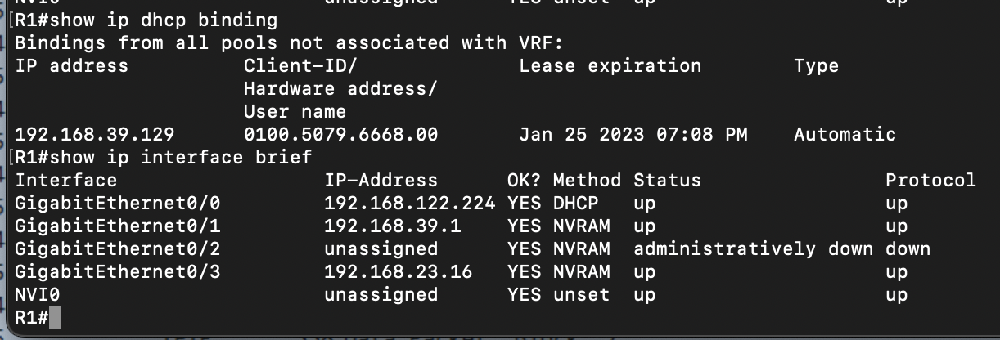
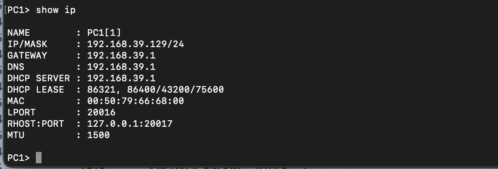
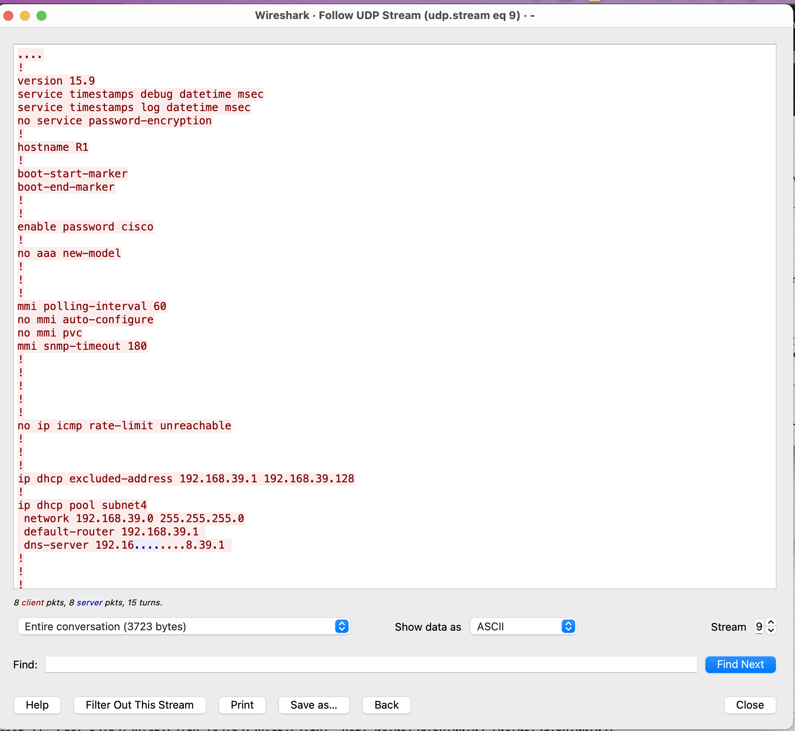

# Laborübung 4: TFTP

Vollständige Aufgabenstellung findet man [hier](https://gitlab.com/alptbz/m123/-/blob/main/07_Datei%C3%BCbertragung/01_TFTP.md)

## Erledigte Vorbereitungen
 - Projekt von Teams importiert (Version fuer Person 2)
  
  
## 1. TFTP Server auf lokalem PC starten
 -  heruntergeladen
 - Root Ordner angelegt
## 2. Konfiguration via TFTP auf den lokalen PC senden/kopieren
  ```
  copy startup-config tftp
  ```
  
  Das Programm war selber schonn eingerichtet und hat auf dem localhost und auch via VPN auf Requests gehoert.
  Dann musste ich nur den Befehl von oben ausfuehren und hatte die startup-Datei.
#### Fragen
- Wann Werden Änderungen an der startup-config übernommen?
  - Beim Neustart, da dann die startup-config neu geladen wird ins NVRAM und eigentlich das Betriebssystem konfiguriert.

## 3. Konfiguration bearbeiten
  - Position in Klassenliste = 15
  - Neue IP = 192.168.39.0/24 
  - Alle Subnetze der Art 192.168.4 angepasst durch "Search and Replace"
  - Neue Config File ist im Ordner "config" zu finden.

## 4. Konfiguration auf den Router uploaden

```
copy tftp: startup-config
```
Daraufhin ein reload mit 
```
reload
```

- Mit welcher Abfolge von Befehlen kann eindeutig festgestellt werden, dass die Subnetzanpassung erfolgreich war und alle Services (DHCP, DNS, usw.) eindeutig funktionieren?
  - Router:
    ```
    show running-config
    Show IP interface binding brief
    show ip dhcp binding 
    ```
  - Output ip interface und dhcp binding:
    
  - PC1:
    ```
      show ip
      ping google.ch
    ```
  - Output PC1:
  

  
## 5. TFTP Protokoll beobachten
- Capture ist im pcap Ordner (Senden und Empfangen)
- Config die durch "Follow UDP Stream" herausgekommen ist:
  - 
- Es gibt auch die Funktion im Wireshark, dass es die Daten von einem TFTP Stream mit der Einstellung "Reassemble fragmented TFTP Files".

## Weiterführende Ressourcen 
- Dokumente auf Teams mit den Commands 

## Neue Lerninhalte
- TFTP Protokoll
- Firmware flashen

## Reflexion
Sehr muehsames Labor, da gewisse Programme fuers TFTP nicht geklappt haben.
Ansonsten ganz okay, war jetzt nicht das spannendste aber war mal etwas komplett neues.