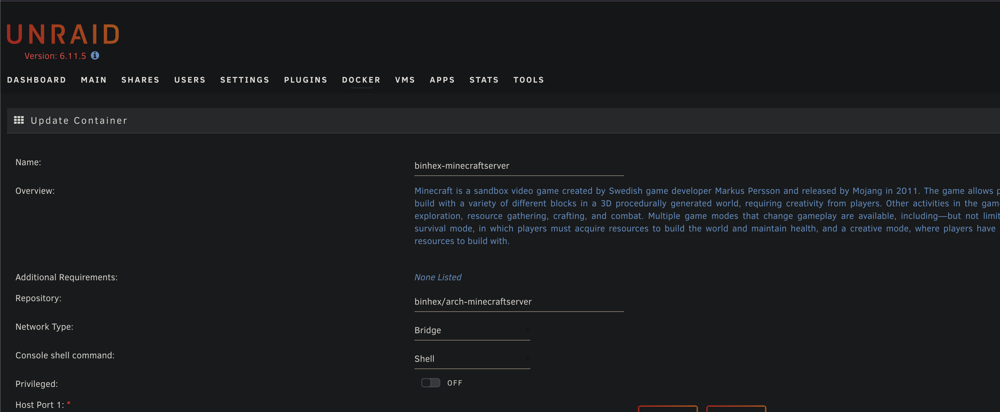
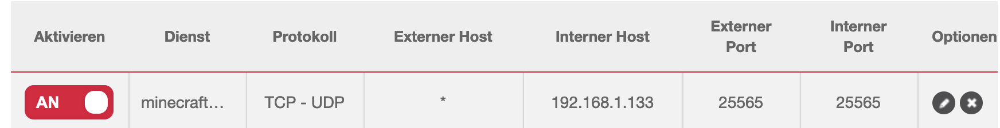
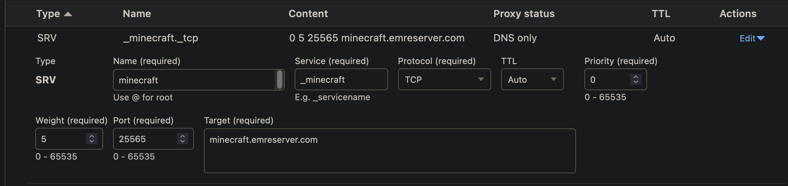

# Zusatzaufgabe : Minecraft Server aufsetzen mit eigener Domain

Aufgabenstellung:
- Auf UnraidOS einen Minecraft Server aufsetzen
- Extern zugaenglich machen
- eigene Domain verbinden
## Erledigte Vorbereitungen
- Laufendes NAS auf dem Heimnetzwerk
- Besitz eigener Domain
## Domain einrichten und Dynamic DNS gewaehrleisten
- Domain vor Jahren auf [Namecheap](https://www.namecheap.com/) erworben.
- Spaeter auf [Cloudflare](https://www.cloudflare.com/en-gb/) gewechselt.
- DynamicDNS mit dem folgenden Projekt realisiert: [Docker CloudFlare DDNS](https://github.com/oznu/docker-cloudflare-ddns)
  - Container ist mit dem Cloudflare account verbunden (via API-Key) und ersetzt die IP-Adresse vom A-Record, wenn die IP-Addresse sich aendert.
## Minecraft Server installieren und testen
- Auf Unraid gibt es einen "Application Store", auf dem verschiedene Docker Container gehosted werden, zum Teil mit Anpassungen fuer Unraid-Benutzer spezifisch.
- Fuer die Aufgabe verwende ich den Container von Binhex, der [hier](https://registry.hub.docker.com/r/binhex/arch-minecraftserver/) zu finden ist. Die Standard-Einstellungen wuerden beibehalten, ausser das Password fuer das Web-interface.

Lokaler Zugriff funktionierte ueber die IP meines NAS und dem Port 25565. So weit so gut.
## Ports freigeben
Im GUI vom Sunrise Router erstelle ich folgende Portfreigabe:
. 
Zugriff via externer IP und Port-Number funktioniert.
## Minecraft Server zur Domain verknuepfen
- Als erstes braucht es einen CNAME-Record fuer den Minecraft Server. Ich nenne es ganz passend "minecraft".
- Als zweites braucht es einen SRV-Record, welcher den Service angibt, die Ports angibt und die Ziel-Domain.
- Das sieht wie folgt aus:
- 
- Externer Zugang via "minecraft.emreserver.com" geht. (Bitte schreiben wenn sie mit dem bewerten fertig sind, damit ich den Server offline nehmen kann :)).

## Weiterführende Ressourcen 
- Tutorial vom ganzen: https://www.youtube.com/watch?v=uVV-L1GBvQo&t=832s
## Neue Lerninhalte
- SRV Record benutzt
- Minecraft Server gehosted

## Reflexion
Sehr interessante Aufgabe mit neuem Lerninhalt. Funktioniert gut und ist sehr simpel aufzubauen und das Endergebniss macht sogar Spass :) .

